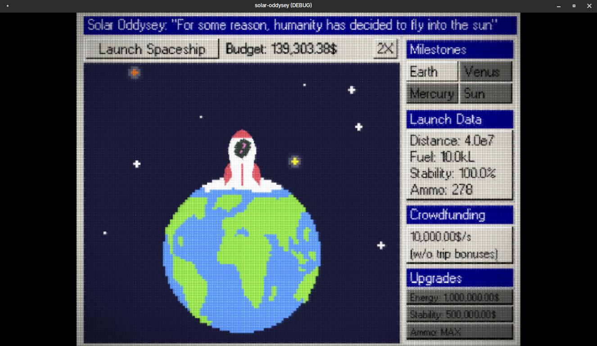

## Solar Oddysey

is a cosmic adventure game developed in Godot
where you pilot a rocket through the treacherous solar system to reach the Sun.
Your job is to navigate through asteroids and complete your ultimate mission.
Heavily inspired by my favorite game, Earn to Die (2) :D

There are multiple types of passive and active incomes, play around with
the different upgrades to see which combinations suit you and helps you
reach the Sun faster!

## Gallery

## Credits

- CRT shader: https://godotshaders.com/shader/crt-video-like-shader/
- Spaceship explosion: https://bdragon1727.itch.io/free-effect-bullet-impact-explosion-32x32
- SFX:
	- BGM: https://www.youtube.com/watch?v=FlTlv8QIlfs
	- Rocket take off: https://mixkit.co/free-sound-effects/rocket/
	- Laser: https://pixabay.com/sound-effects/retro-laser-1-236669/
	- Asteroid: https://pixabay.com/sound-effects/asteroid-hitting-something-152511/
	- Boom: https://pixabay.com/sound-effects/russianmeteorite-sfx-76195/
	- Rocket landing: https://mixkit.co/free-sound-effects/rocket/
	- Engine: https://pixabay.com/sound-effects/engine-61234/
